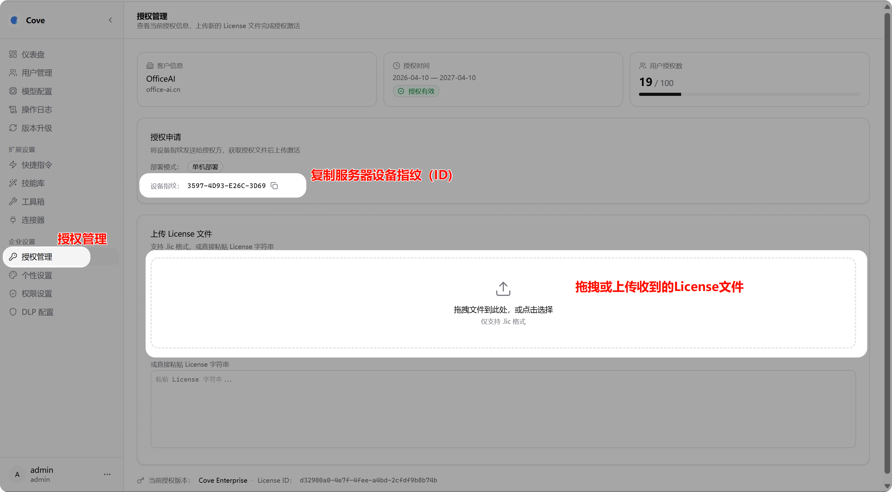
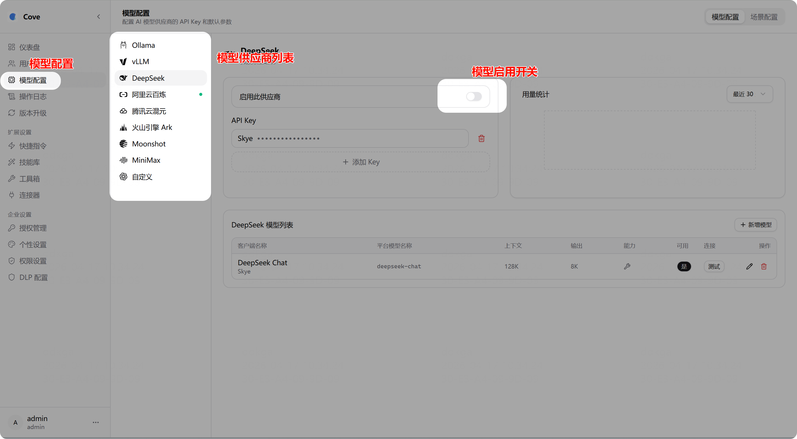
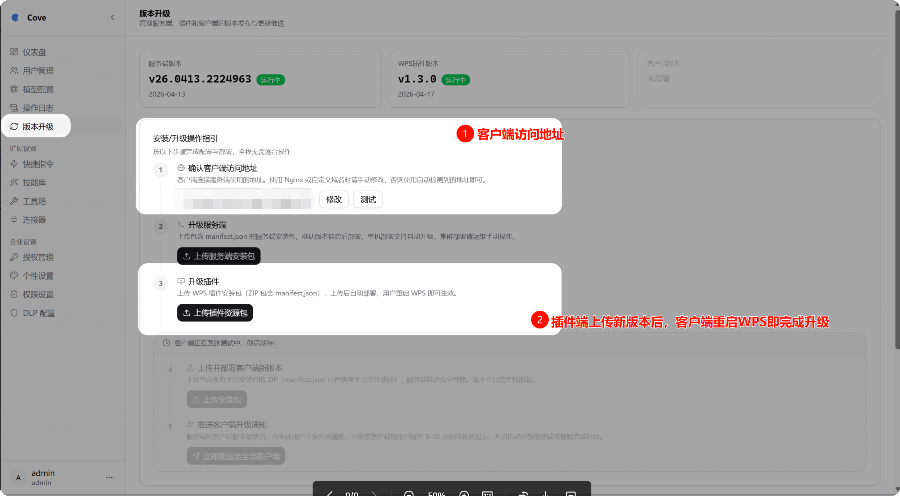
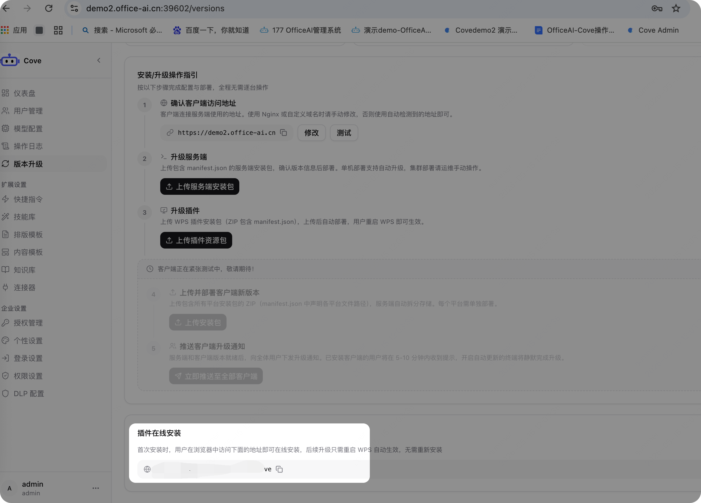
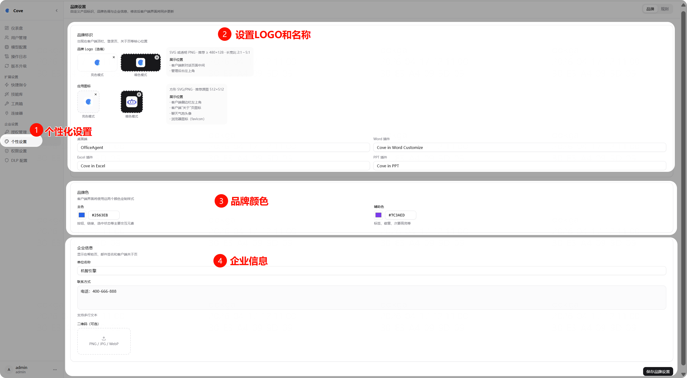

# 服务端部署

## 注意事项

- ⚠️ **尽量避免和其他业务共用服务器**，避免冲突
- ⚠️ **不要更改安装脚本与文件**，会导致部署失败

## 安装步骤

1. 下载安装包并解压（根据CPU架构选择对应的安装包）：

```bash
unzip cove-v26.0410.1911125-linux-amd64.zip
```

2. 进入解压目录，执行安装脚本：

```bash
cd cove-v26.0410.1911125-linux-amd64/
./setup.sh
```

3. 按提示操作（一路回车即可使用默认配置）
4. 安装完成后访问管理后台，使用 `Setup Token` 初始化管理员密码
5. 以下是完整部署后的整体界面参考：

```Shell
# 进入解压后的目录
$ cd cove-v26.0410.1911125-linux-amd64/
# 执行安装脚本
$ ./setup.sh
cove v26.0410.1931625 (amd64)

请输入安装目录 [/data/cove]:
将首次安装到: /data/cove

管理后台端口 [52001]:
客户端端口 [52000]:
权限不足，使用 sudo 创建目录...
安装文件...
cove-wps 插件已安装

启动服务...
started cove-admin (pid 41586)
started cove-client (pid 41587)
等待服务就绪（最多 120s）...

安装完成。

  管理后台: http://localhost:52001
  客户端:   http://localhost:52000

  ┌─────────────────────────────────────────────┐
  │  Setup Token: ecc3c7f2f6630794fd166d7ecacd5035  │
  │  请在管理后台初始化页面输入此 Token 设置管理员密码  │
  └─────────────────────────────────────────────┘
```

## 快速配置

### 登录管理后台

访问 `http://<服务器IP>:52001`，使用安装时生成的 Setup Token 设置管理员密码（部署后底部会显示）。

> 默认用户名为 `admin`

### 导入 License

管理后台 → 企业设置 → 授权管理

将服务器设备指纹（ID）发给我们获取 License 文件，上传即可。



### 配置大模型

管理后台 → 模型配置

系统内置了多个模型平台，可以直接配置使用。



### 客户端发布

管理后台 → 版本升级

- 检查客户端接口请求地址是否正确
- 首次安装不需要上传客户端，直接使用底部的在线安装地址即可
- 后续升级，可在此上传插件安装包后，用户自动静默升级
- 支持在线安装和命令行安装两种方式



客户端安装地址：



插件是在线安装的，直接滑到底部，找到对应的安装地址，发给用户即可安装

### 品牌定制

管理后台 → 企业设置 → 品牌定制

可自定义产品标识、品牌色调与企业信息，修改后客户端界面同步更新。


