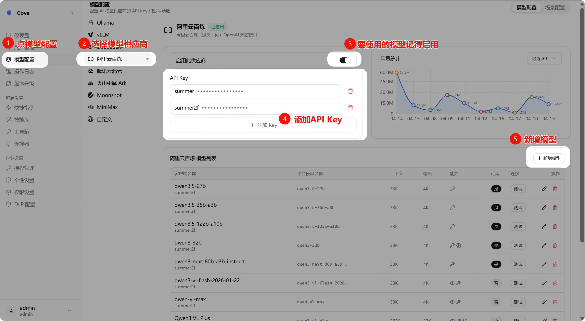
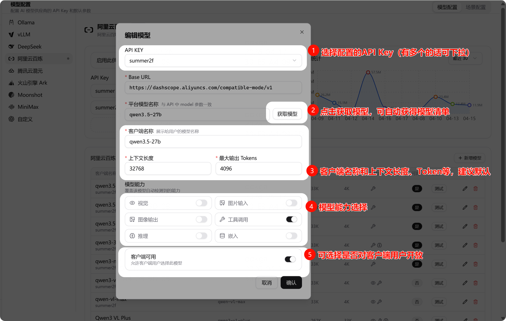
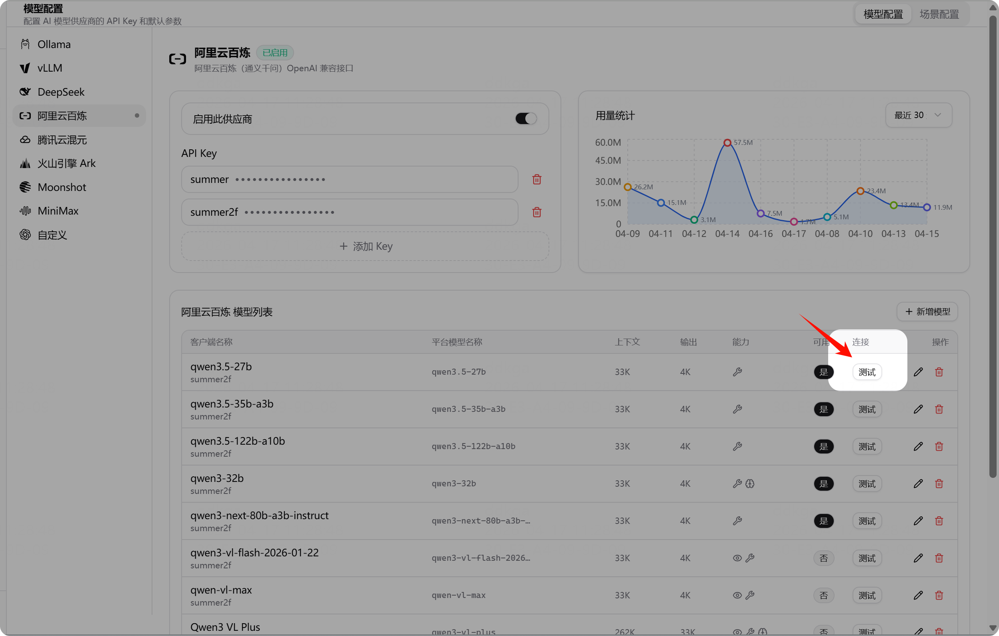
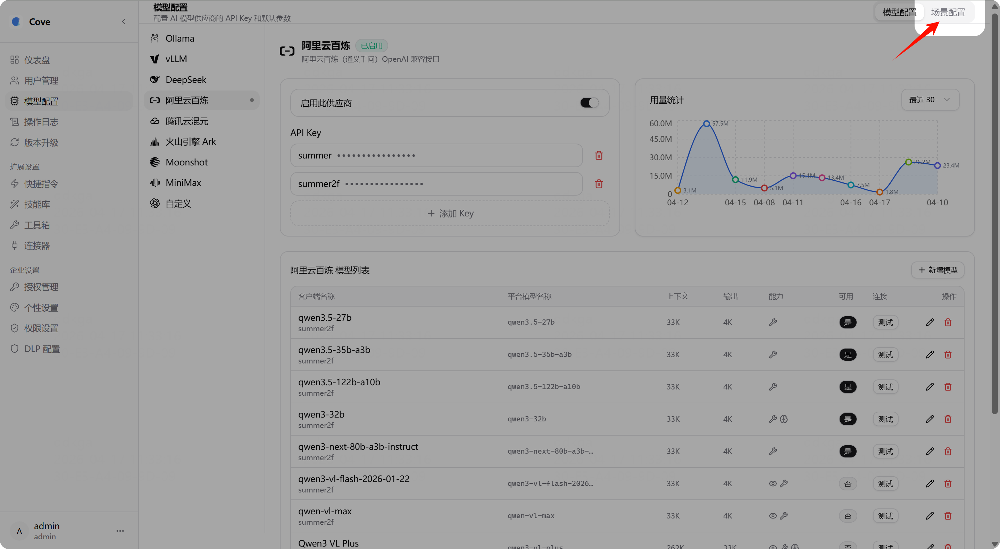

# 大模型配置

管理后台支持接入 9 类模型平台。

## 模型平台列表

| 平台标识 | 名称 | 适用场景 |
|---------|------|---------|
| `ollama` | Ollama | 本地开源模型 |
| `vllm` | vLLM | 高性能本地推理 |
| `aliyun` | 阿里云百炼（通义千问） | OpenAI 兼容 |
| `deepseek` | DeepSeek | OpenAI 兼容 |
| `tencent-cloud` | 腾讯云混元 | OpenAI 兼容 |
| `volcengine-ark` | 火山引擎 Ark | OpenAI 兼容 |
| `moonshot` | Moonshot | OpenAI 兼容 |
| `minimax` | MiniMax | OpenAI 兼容 |
| `custom` | 自定义 | 任意 OpenAI 兼容接口 |

> 其中只有 Ollama 和 vLLM 是内网模型平台，其余均为外网或专网模型平台。

## 添加模型

管理后台 → 模型配置

找到要接入的平台（如 Ollama），添加 API Key，点击「新增模型」：

## 配置模型

| 参数 | 说明 |
|------|------|
| **上下文长度** | 限制发给模型的最大字符数，建议参考官方文档设置 |
| **最大输出 Tokens** | 单次最大输出，0 表示不限制 |
| **工具（Function Call）** | 确认模型是否支持函数调用 |
| **推理** | 主要针对 Qwen3 等可开关推理的模型 |
| **图像类能力** | 多模态模型（如 Qwen2.5-VL）需勾选此选项 |

## 测试连接

配置完成后，点击「测试」按钮验证模型是否可用。成功则显示「正常」。

## 场景配置

可为特定场景（如识图）指定专用模型。管理后台 → 模型配置 → 场景配置。

选择支持对应能力的模型并保存即可。
