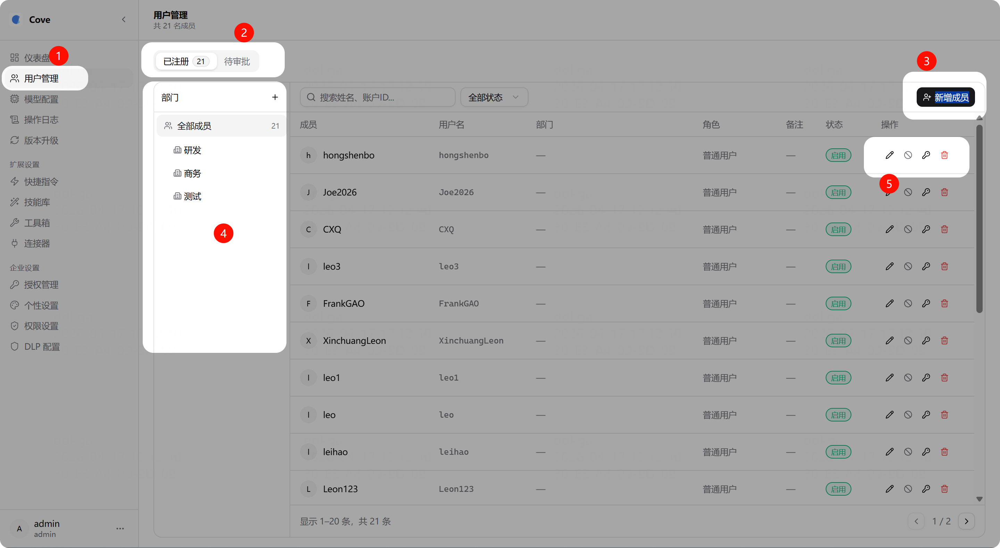
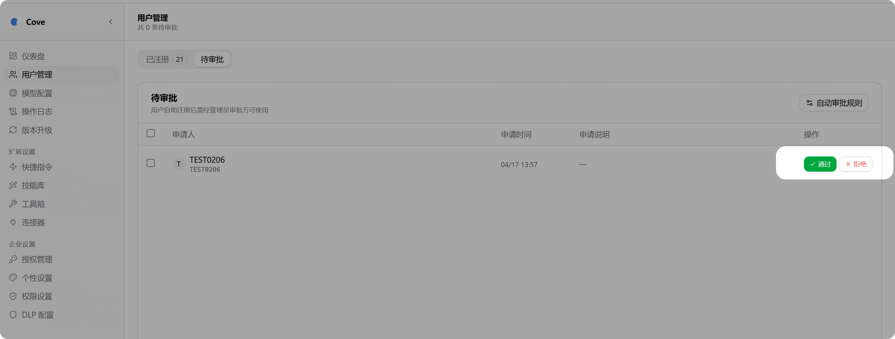
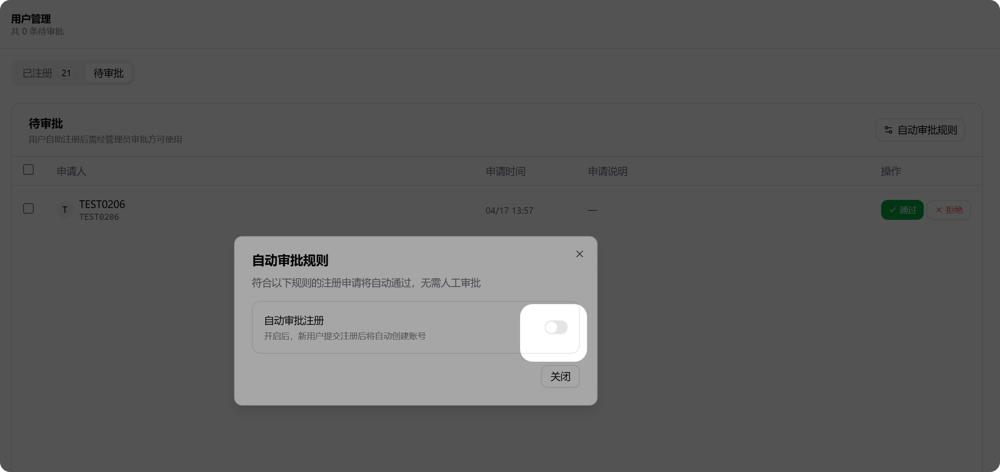
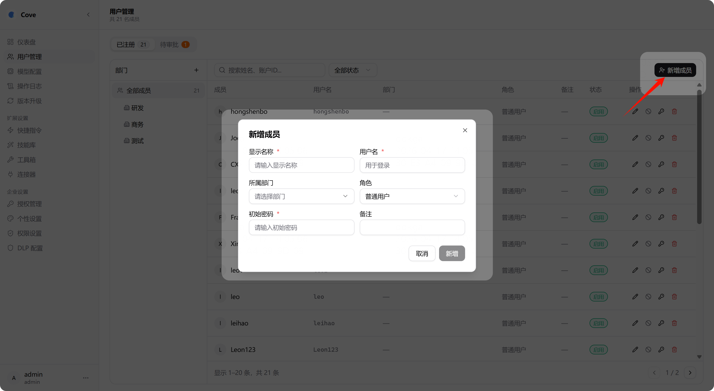
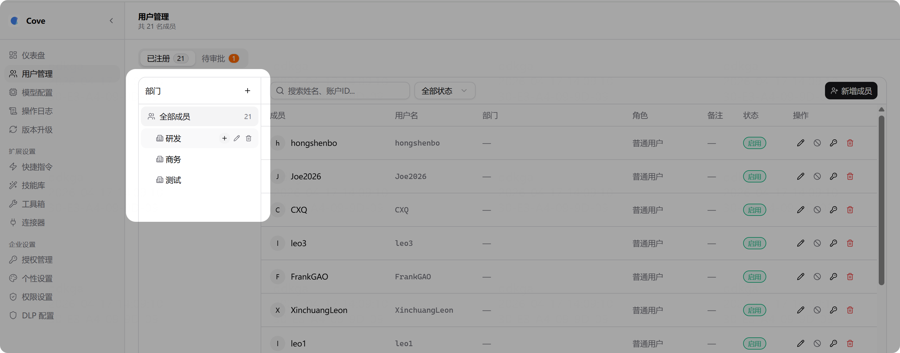
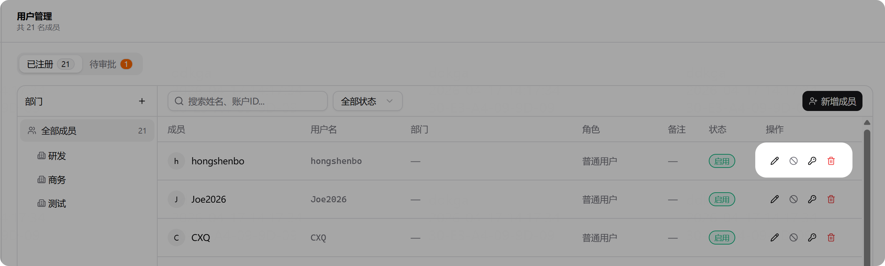

# 用户管理

## 入口

管理后台 → 用户管理

可以对客户端账号进行：新增、编辑、分组、权限设置、启用/禁用、删除。

## 用户注册与审批

客户端用户可以在插件端自行注册，管理员在此审批：

可以设置**自动审批规则**，注册后直接登录，无需人工审批：

## 新增用户

管理员也可以手动为用户创建账号：

## 部门管理

支持创建符合组织管理需求的部门架构。部分功能权限可设置仅对某些部门生效。

## 成员信息管理

对每个成员可以进行以下操作：

1. **编辑**：修改成员信息
2. **禁用**：暂停账号使用
3. **重置密码**：将密码重置为默认值
4. **删除**：移除账号

## 权限管理

支持 RBAC 角色权限控制和三员分立：
- **系统管理员**（sys_admin）
- **安全管理员**（sec_admin）
- **审计管理员**（audit_admin）

可在后台在线切换三员分立模式。

## SSO 单点登录

支持标准 OIDC/OAuth 2.0，以及华信、天华等定制身份提供商，同时支持组织架构自动同步。
