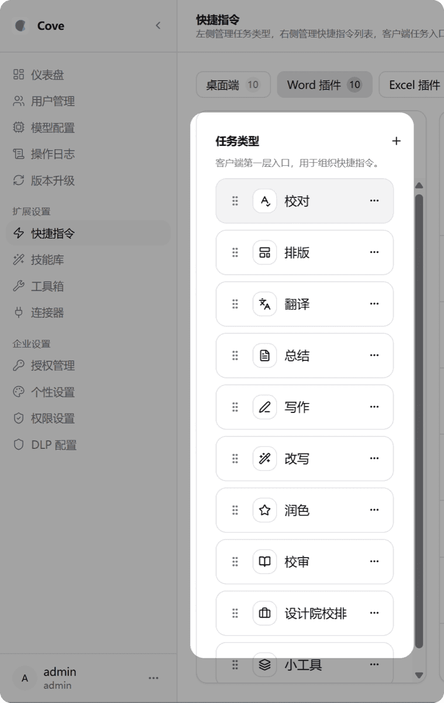
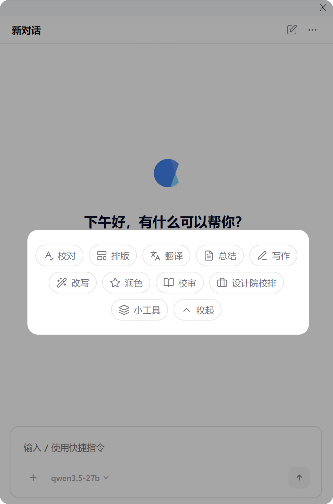
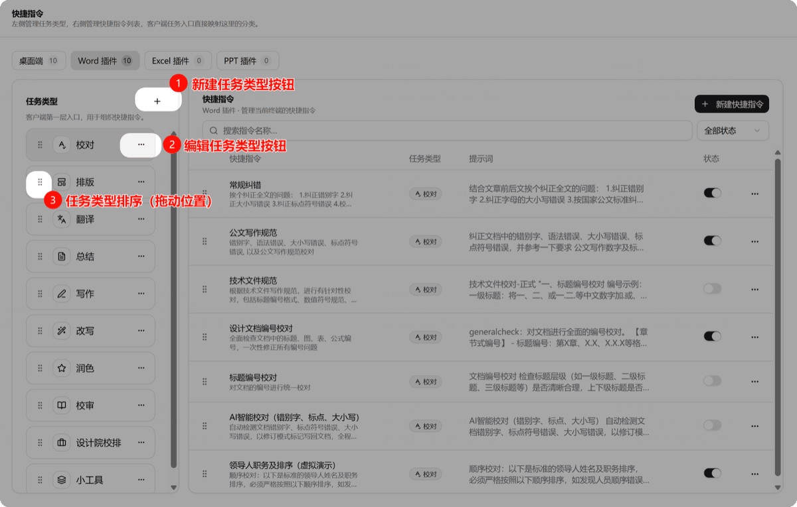
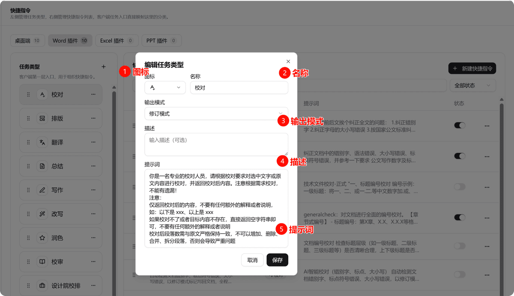
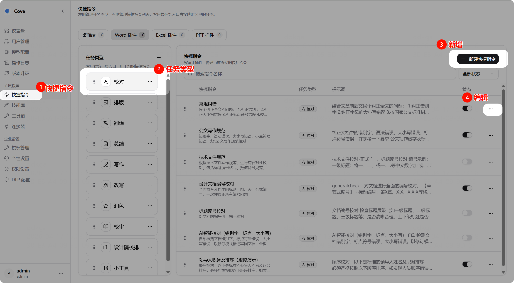
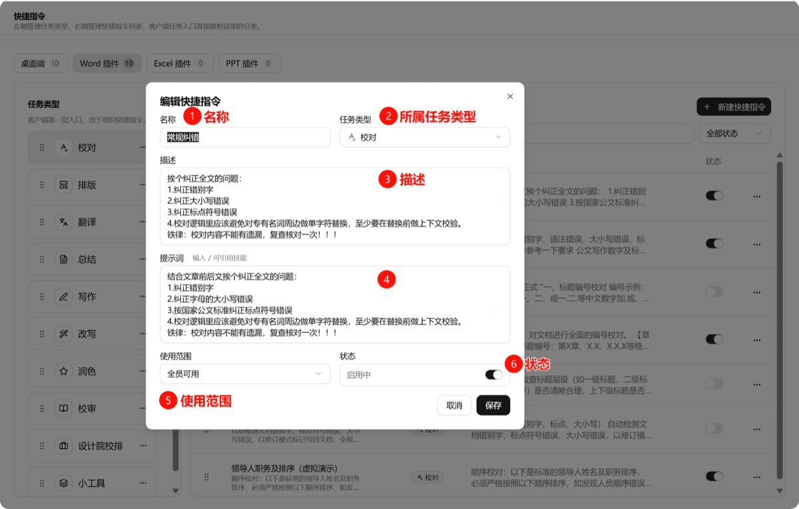

# 任务类型与快捷指令

这是 OfficeAI 的核心配置——决定用户在客户端看到什么功能、怎么使用。

## 概念关系

```
任务类型（如「校对」）
    └── 快捷指令（如「常规纠错」「公文写作规范」）
           └── 提示词（实际指导 AI 如何执行任务）
```

管理端配置的按钮和客户端显示一一对应：

| 管理后台 | 客户端 |
|---------|--------|
|  |  |

## 任务类型

管理后台 → 快捷指令（上方区域为任务类型管理）



| 操作 | 说明 |
|------|------|
| **新建** | 创建新的任务类型 |
| **编辑** | 修改任务类型的图标、名称、提示词等 |
| **排序** | 拖动调整按钮在客户端的显示顺序 |

### 编辑任务类型



| 字段 | 说明 |
|------|------|
| **图标** | 选择客户端显示的图标 |
| **名称** | 自定义任务类型名称 |
| **输出模式** | 建议保持默认 |
| **描述** | 让用户知道该任务的用途 |
| **提示词** | ⭐ 重要：约束该任务类型下所有快捷指令的生成效果 |

## 快捷指令



| 操作 | 说明 |
|------|------|
| **新增** | 创建新的快捷指令 |
| **编辑** | 修改名称、提示词、使用范围等 |
| **启用/关闭** | 控制客户端是否可见 |

### 编辑快捷指令



| 字段 | 说明 |
|------|------|
| **名称** | 显示在客户端的名称 |
| **任务类型** | 归属哪个任务 |
| **描述** | 给用户看的功能说明 |
| **提示词** | ⭐ 核心：清晰准确的提示词决定执行效果 |
| **使用范围** | 指定哪些部门或人群可见 |
| **状态** | 启用或关闭 |
