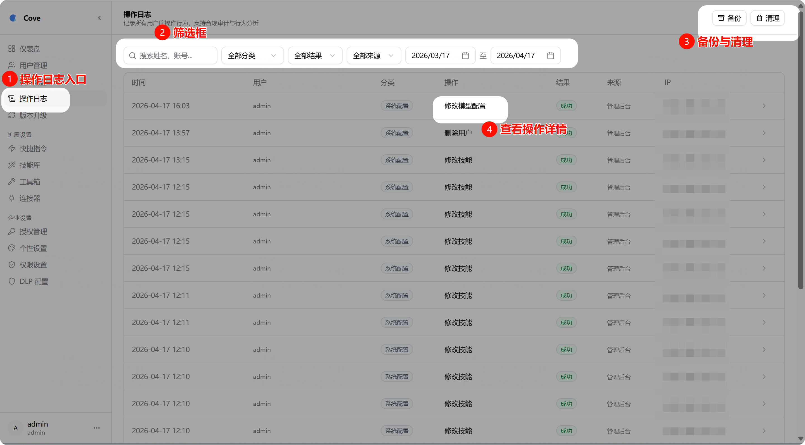
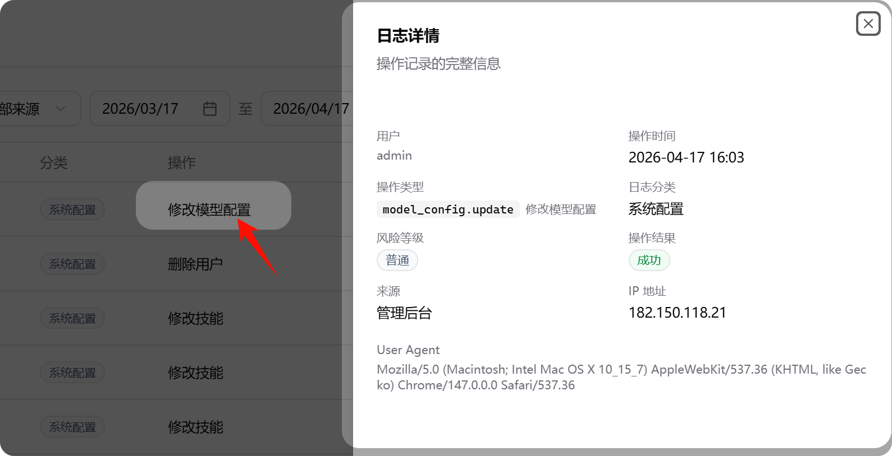
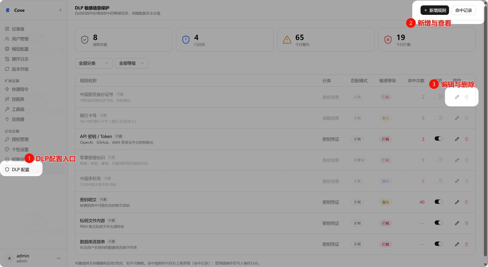
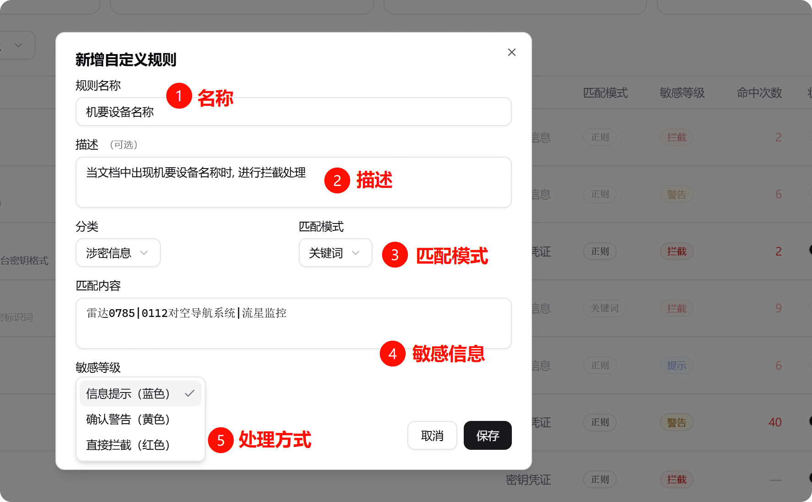

# 安全配置

## 操作日志

管理后台 → 操作日志

记录所有管理员的操作行为：

| 功能 | 说明 |
|------|------|
| **筛选** | 按姓名、账号、分类、结果、时间筛选 |
| **备份与清理** | 备份或清理某一时间段的日志 |
| **查看详情** | 查看操作的具体内容 |

> ⚠️ 清理的日志无法恢复，请谨慎操作。

## DLP 配置（敏感信息保护）

管理后台 → DLP 配置

保护文档中的敏感信息，可设置敏感词和处理策略。

### 新增规则

| 字段 | 说明 |
|------|------|
| **名称** | 规则名称 |
| **描述** | 便于管理多条规则 |
| **匹配模式** | 正则或关键词（关键词模式更简单） |
| **敏感信息** | 多个词汇用 `\|` 分隔 |
| **处理方式** | 提示 / 警告 / 直接拦截 |

## 审计追踪

所有变更操作经统一审计中间件记录，覆盖用户管理、模型配置、资产变更等全部管理操作。

## License 授权

- 支持 V1（Ed25519）和 V2（ECDSA P-224）双版本
- 设备指纹绑定，单机/集群两种部署模式
- 离线激活，适用于内网环境
