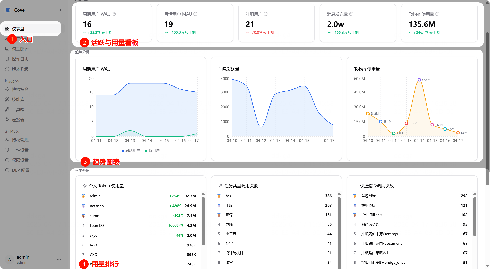
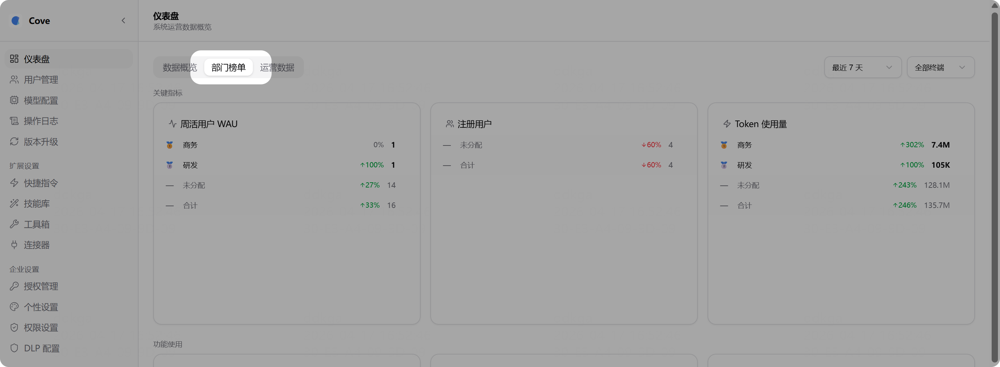

# 仪表盘

## 功能简介

管理后台 → 仪表盘

快速查看企业使用数据，包括活跃用户、用量统计、趋势图和排行榜。

| 功能 | 说明 |
|------|------|
| **活跃看板** | 周活跃、月活跃用户（发起过对话的去重用户数） |
| **趋势图表** | 不同时间段的使用量趋势 |
| **用量排行** | 个人用量、任务类型、快捷指令的调用次数排名 |

## 部门榜单

管理后台 → 仪表盘 → 部门榜单

查看以部门为单位的活跃排行。

> 前提是在用户管理中已编辑好部门架构，并且人员信息与部门匹配。
