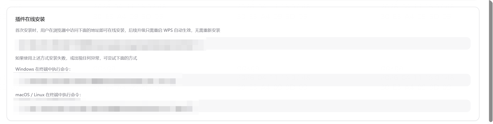
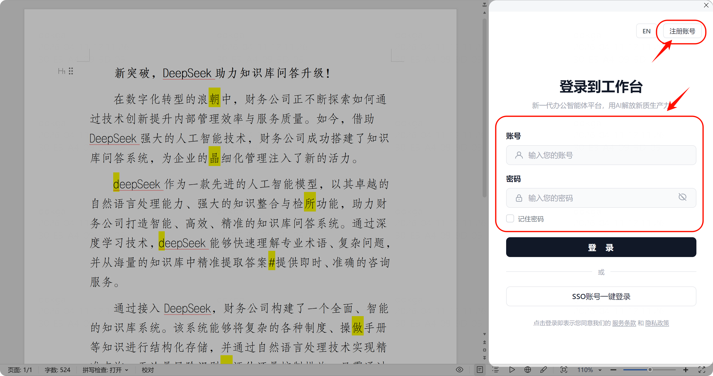

# 安装与登录

## 运行环境

Cove 插件当前支持以下环境：

| 项目 | 要求 |
|------|------|
| 操作系统 | Windows 7（SP1）及以上 / 麒麟 Kylin V10 / 统信 UOS V20 / macOS（X86 及 M 系列芯片） |
| 办公软件 | WPS 2019 及以上 / Microsoft Office 2013 及以上 |

## 在线安装

企业管理员会提供一个专属下载地址。

1. 在浏览器中打开该地址
2. 点击安装按钮（建议使用系统自带浏览器）
3. 安装完成后打开 WPS，即可在右侧看到 Cove 插件面板

> 管理员可在管理后台「版本升级」页面中找到专属下载地址。

## 登录

1. 打开 WPS 后，在插件界面右上方点击「注册」按钮进行注册
2. 注册成功后登录即可
3. **登录状态会一直留存**，下次打开 WPS 无需反复登录

> ⚠️ 管理员可设置是否自动审批用户注册申请，未审批前可能无法登录。

## 升级

- 当管理员在服务端进行升级后，你**无需手动操作**
- 重启 WPS 即可自动使用最新版本
