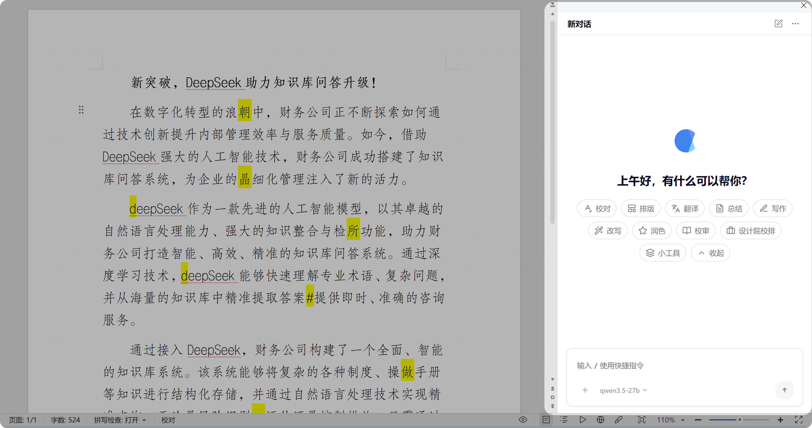

# 界面速览

Cove 插件界面位于 WPS 窗口右侧，简洁直观。以下是主要区域说明：

## 视频教程

  

    
▶️

    
Cove 界面介绍

    
首次加载需等待几秒

  

</a>

## 任务类型按钮

- 清晰呈现核心功能入口，如「校对」「排版」「翻译」等
- 点击某个任务类型，下方会显示该任务下的快捷指令
- **管理员可在后台自定义**按钮的顺序、图标、名称和功能

## 快捷指令按钮

- 点击任务类型后，对应的快捷指令会显示在界面下方
- 快捷指令是某个任务下的具体功能。例如「校对」任务下，有「常规纠错」「公文写作规范」等
- 你可以在界面右上角点击「+」添加个人快捷指令，保存常用提示词

## 自然对话窗口

- 在底部的输入框中输入文字，与 AI 进行自然对话
- 输入 `/` 可快速选择所有快捷指令
- 适合对模型生成结果反复沟通，直到满意为止

## 模型选择

- 如果管理员接入了多个 AI 模型，你可以在此切换
- 不同模型擅长不同的任务：参数大的模型思考能力强，但响应也会慢一些

## 更多操作

- **添加附件**：上传图片或文稿让 AI 识别或处理
- **关联文档**：将多个文档关联，便于对比或合并
- **思考过程**：关闭后可让简单任务的处理速度更快

## 开启新对话

- 点击右上角「开启新对话」按钮
- 可以从任何页面返回插件首页，重新选择任务类型或进行自由对话
