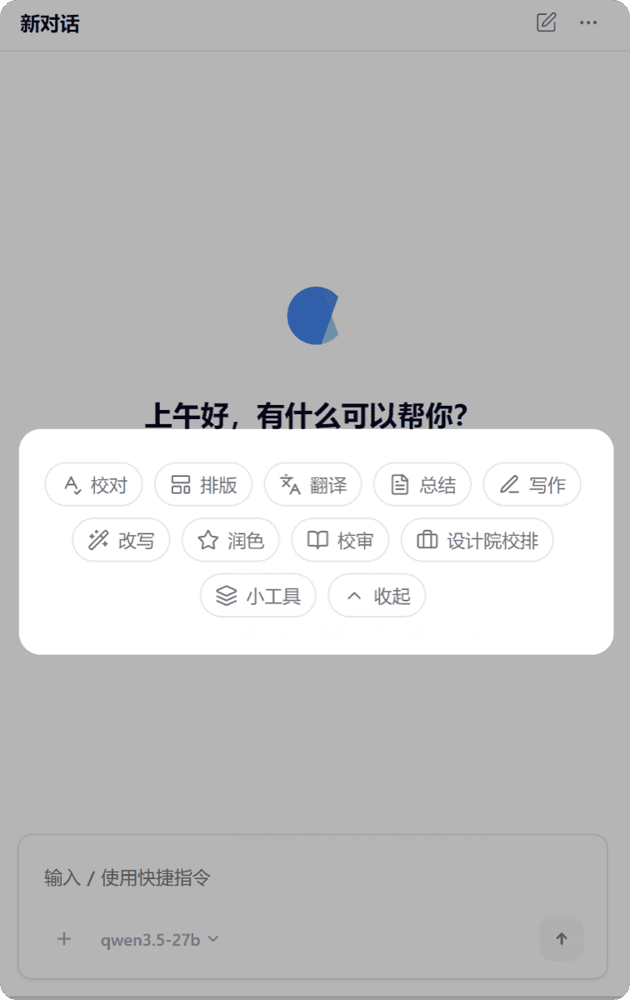
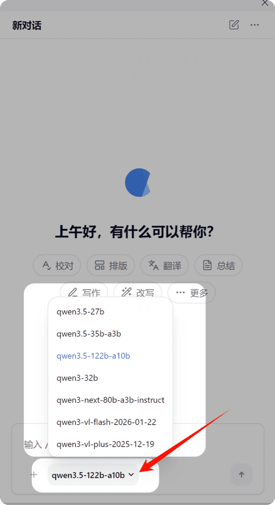

# 界面速览

OfficeAI 插件界面位于 WPS 窗口右侧。主界面分为三个区域：顶部面板栏、中部对话区、底部输入框。

## 任务类型

上方横向排列的是核心功能入口，依次为：

| 按钮 | 功能 |
|------|------|
| **校对** | 纠错、语法检查、国家标准引用校对等 |
| **排版** | 公文/论文排版、模板套用、精细格式调整 |
| **翻译** | 多语种翻译，译文对照显示 |
| **总结** | 智能提炼、会议纪要、周报助手 |
| **写作** | 公文写作、项目申报等各类文稿创作 |
| **改写** | 续写、缩写、扩写、重写 |
| **润色** | 按不同风格美化文本 |
| **小工具** | 文档清理、合并、对比等实用功能 |
| **审查** | 合同审查、标书校审、资质审核 |

点击某个任务类型，下方会显示该任务下的**快捷指令**。

> 管理员可在后台自定义按钮的顺序、图标、名称和功能。

## 快捷指令

- 点击任务类型后，对应的快捷指令会出现在界面下方
- 快捷指令是某个任务下的具体功能。例如「校对」下有「常规纠错」「公文写作规范」等
- 你也可以点击右上角「+」添加个人快捷指令，保存常用的提示词

## 自然对话窗口

- 在底部输入框输入文字，与 AI 进行自然对话
- 输入 `/` 可快速调出所有快捷指令
- 当选择的指令或对话结果不满意时，可以继续追问调整，直到满意为止

## 模型选择

- 如果管理员接入了多个 AI 模型，可在此切换
- 不同模型擅长不同的任务：参数大的模型思考能力强，但响应也会慢一些

## 更多操作

- **添加附件**：上传图片或文稿让 AI 识别或处理
- **关联文档**：选中已打开的文档，便于多文档操作（如合并、对比）
- **思考过程**：关闭后简单任务的处理速度更快

## 开启新对话

- 点击右上角「开启新对话」按钮
- 回到首页，重新选择任务类型或进行自由对话

## 历史记录

在面板栏左侧点击历史图标，可查看所有历史对话。支持搜索、重命名、置顶、删除等操作。

## 设置

在面板栏右侧点击设置图标，可进行以下操作：

- **切换模型**：选择不同的 AI 模型
- **导出对话**：将当前对话导出为 PDF
- **语言切换**：切换界面语言（中文/英文）
- **字号调整**：调整界面字体大小
- **刷新配置**：手动拉取服务端最新配置
- **退出登录**：退出当前账号
