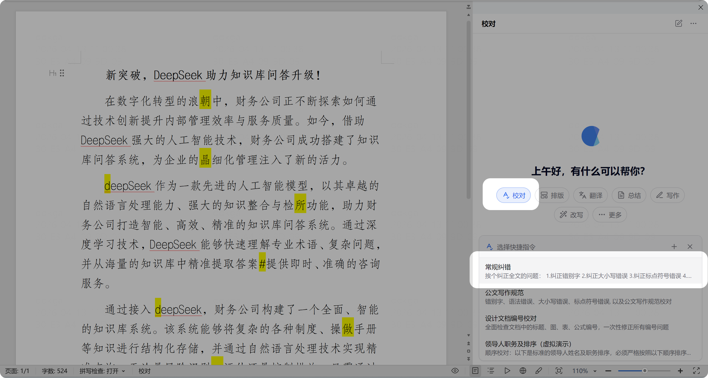
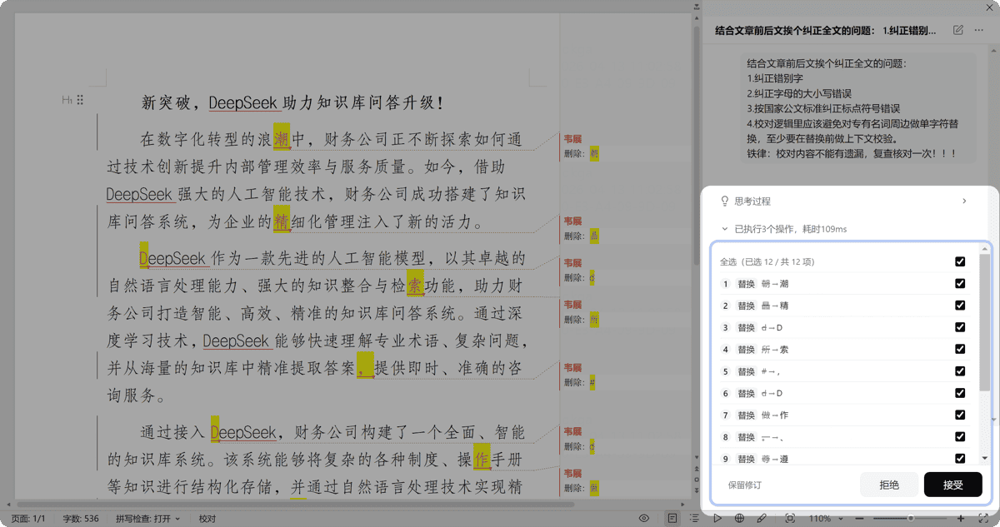

# 校对文档

> 用 AI 找出文档中的错别字、语法错误等并进行纠正。

## 常规纠错

1. 打开一篇需要校对的文档
2. 点击任务类型中的「校对」
3. 选择「常规纠错」快捷指令
4. 等待处理完成，弹出确认窗口

 

## 视频教程

  
▶️

  
基础校对演示

  <a href="https://github.com/cove-apps/product-manual/releases/download/video-tutorials/02-proofread.mp4" target="_blank" style="display:inline-block;padding:6px 14px;background:#2563eb;color:#fff;border-radius:6px;text-decoration:none;font-size:13px;">📥 下载视频</a>

## 其他校对功能

内置的其他校对快捷指令包括：

| 功能 | 说明 |
|------|------|
| **公文写作规范** | 针对党政公文格式的专项校对 |
| **技术文档校对** | 面向技术文档的专业校对 |
| **领导人职务及排序** | 检查领导人姓名、职务、排序规范 |
| **国家标准引用校对** | 识别国家标准引用错误（编号格式、名称错配、标准过期等） |

## 关于快捷指令

- 初始快捷指令较为通用，管理员可在后台随时调整
- 你可以点击「+」新增个人快捷指令，保存常用需求

> 复杂校对需求可联系服务顾问定制。
