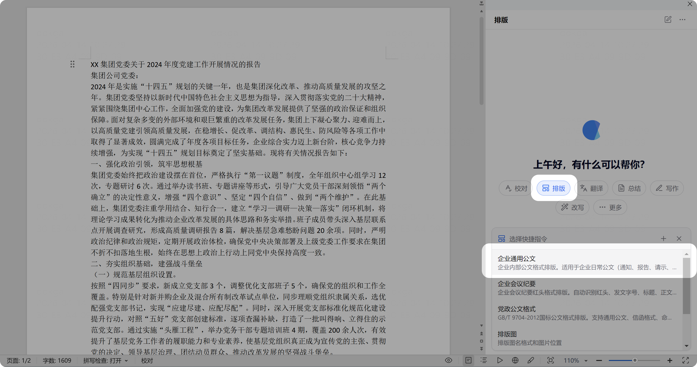

# 排版文档

> 一键将文档变成符合要求的排版格式，包括字体、行间距、编号格式、页边距等。

## 企业通用公文

1. 打开一篇没有格式的文档
2. 点击任务类型中的「排版」
3. 选择「企业通用公文」
4. 等待处理完成，预览排版效果，可选择保存或撤销

> ⚠️ 排版后的效果确认界面截图暂缺，将在后续更新中补充。

## 视频教程

<video src="/videos/cove/4.通用排版.mp4" controls width="100%" style="max-width:720px;border-radius:8px;">
  您的浏览器不支持视频播放，请下载后观看。
</video>

<video src="/videos/cove/6.一键排版.mp4" controls width="100%" style="max-width:720px;border-radius:8px;">
  您的浏览器不支持视频播放，请下载后观看。
</video>

## 其他排版功能

| 功能 | 说明 |
|------|------|
| **企业会议纪要（红头）** | 自动生成红头会议纪要模板 |
| **党政公文格式** | 符合 GB/T 9704-2012 国家标准 |
| **学术论文排版** | 符合 GB/T 7713.2-2022 国家标准 |
| **一键套用模板** | 从已有文档提取模板，套用到当前文档 |

## 极速排版

Cove 的排版引擎可在 1 分钟内完成 50 万字级长文档的排版，支持 OOXML 包级写入，无需逐段调用 WPS API。

## 关于模板

- **提取模板**：从一份格式规范的文档中提取排版模板
- **套用模板**：将已有模板一键应用到当前文档
- 模板资产可由管理员在后台统一管理分发

> ⚠️ 部分截图因版本更新可能和当前实际界面有差异，以实际操作为准。
