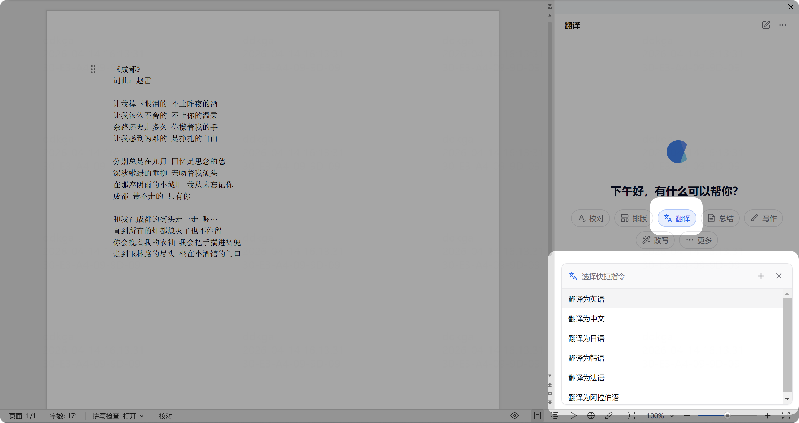
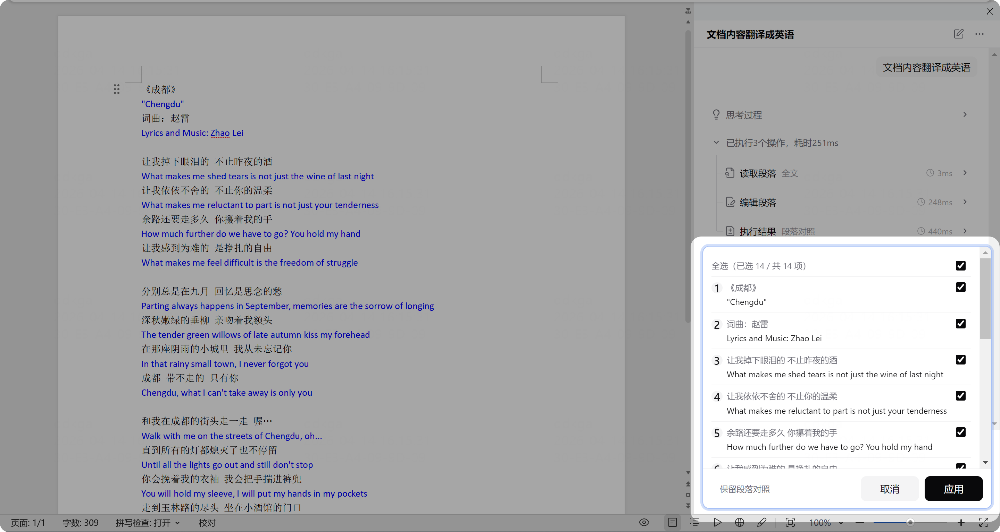

# 翻译文档

> 支持多语种翻译，译文与原文对照显示，方便逐条确认。

## 多语种翻译

1. 打开一篇需要翻译的文档
2. 点击任务类型中的「翻译」
3. 选择目标语言（如「中文翻译为英文」）
4. 等待处理完成，文档中会生成对照译文

 

## 视频教程

<video src="/videos/cove/12.翻译.mp4" controls width="100%" style="max-width:720px;border-radius:8px;">
  您的浏览器不支持视频播放，请下载后观看。
</video>

翻译结果以颜色区分：
- **原文**保持原有颜色
- **译文**以蓝色显示，与原文段落对照排列
- 确认弹窗中可逐条或全部确认

## 新增翻译语种

如果需要的语种不在内置列表中：

1. 点击快捷指令旁的「+」
2. 输入自然语言描述，如「将文档内容翻译成葡萄牙语」
3. 保存为快捷指令，方便后续调用

## 技术说明

- 支持中英、英中及其他常见语种
- 支持 RTL（从右到左）语言
- 支持选区翻译和全文翻译两种模式
- 任务中途取消可整篇恢复到原文状态
