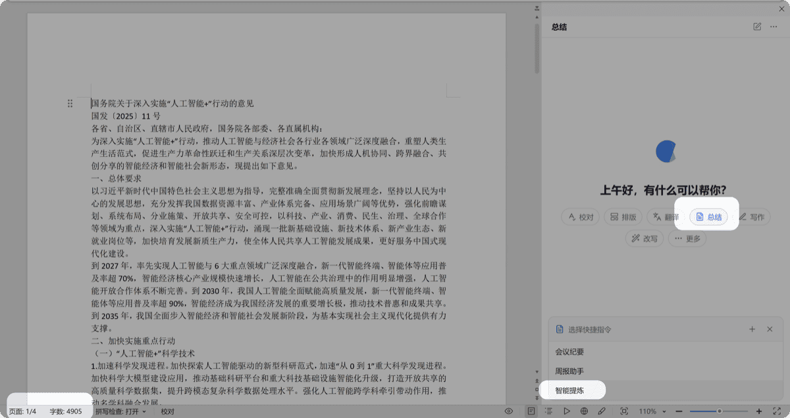
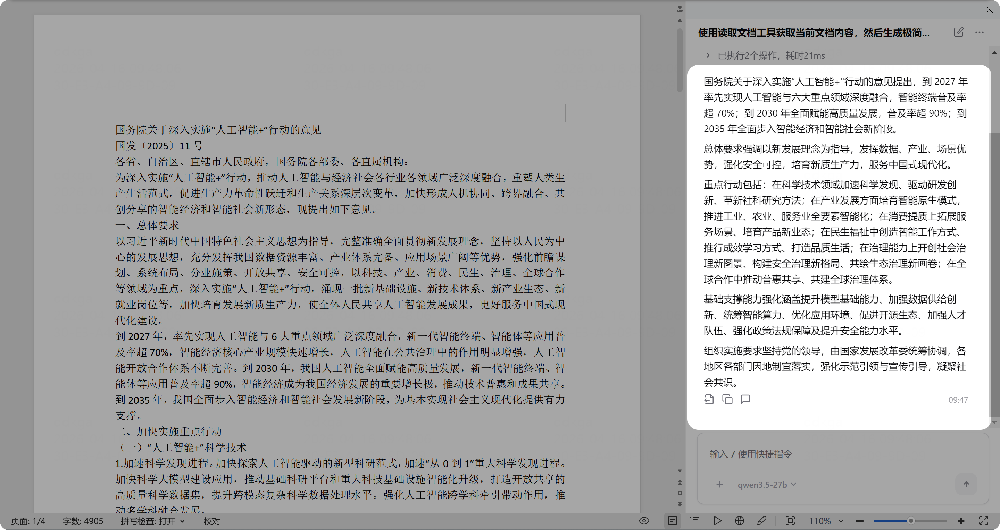
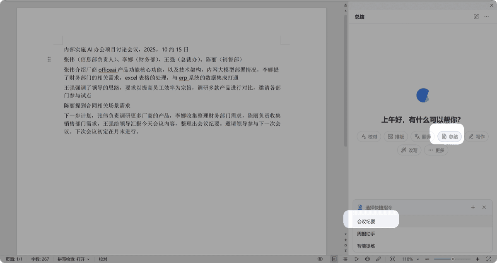
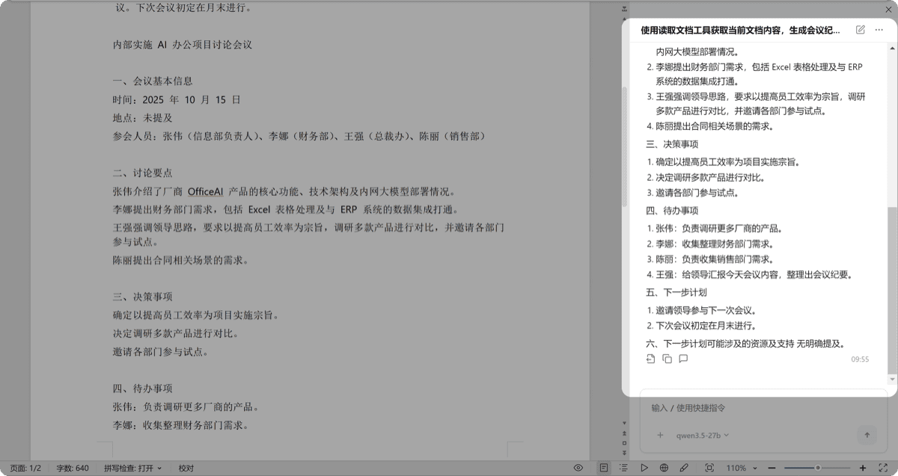
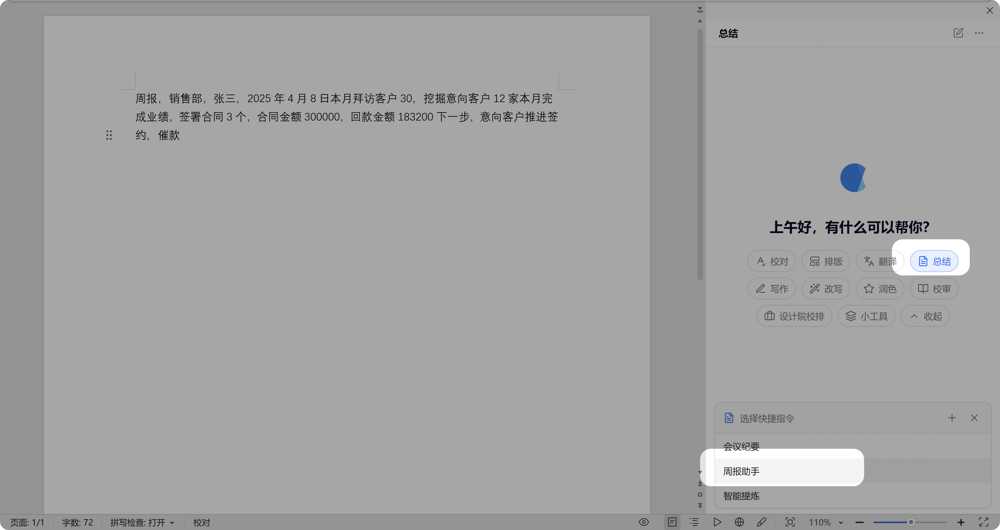
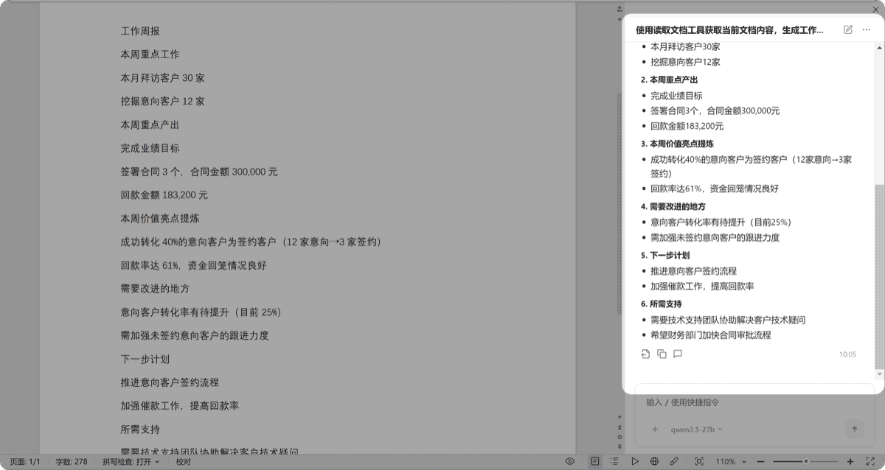

# 总结文档

> 内置三种模式：智能提炼、会议纪要、周报助手。根据文档内容自动生成结构化总结。

## 智能提炼

快速提取长文档的核心要点，适合快速了解长篇内容。

1. 打开一篇长文档（如 5000 字以上的报告）
2. 点击「总结」→「智能提炼」
3. AI 提炼文档重点，可一键导入文档或复制

 

## 视频教程

▶️ 总结提炼演示 点击播放

▶️ 会议纪要演示 点击播放

## 会议纪要

将简要速记的会议记录快速变成正式的会议纪要。

1. 在文档中记录会议速记内容
2. 点击「总结」→「会议纪要」
3. AI 生成要点、决策事项、待办事项及下一步计划

 

## 周报助手

将初步记录的工作内容整理成标准框架的周报。

1. 在文档中记录本周工作要点
2. 点击「总结」→「周报助手」
3. AI 整理成涵盖重点工作、产出、亮点、改进方向及下一步计划的标准周报

 

> 以上三种模式均支持管理员在后台自定义框架结构，也支持你在客户端添加不同的快捷指令。
