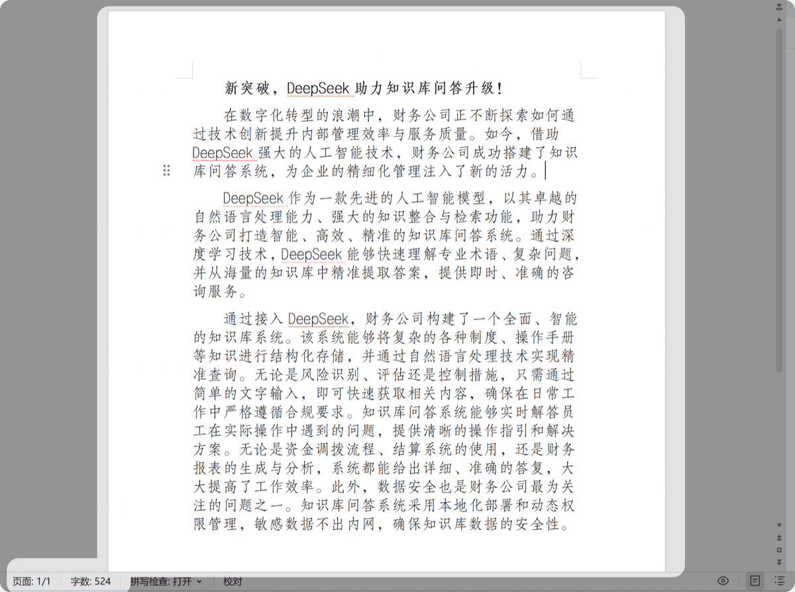
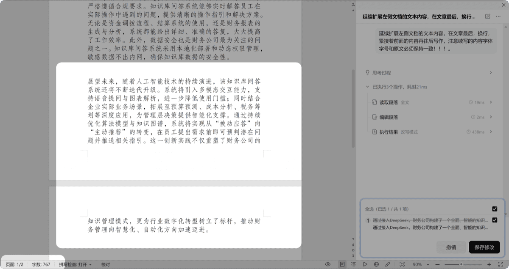
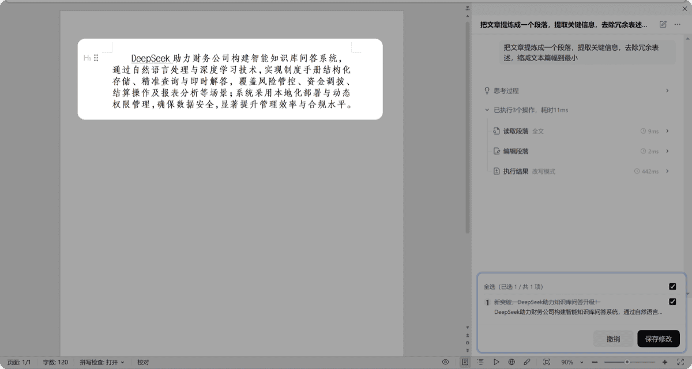
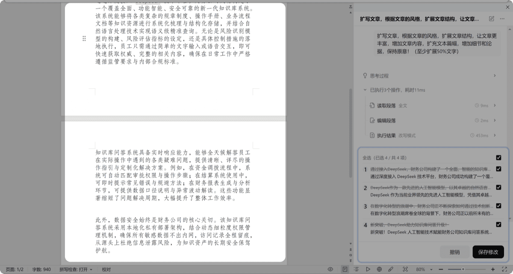
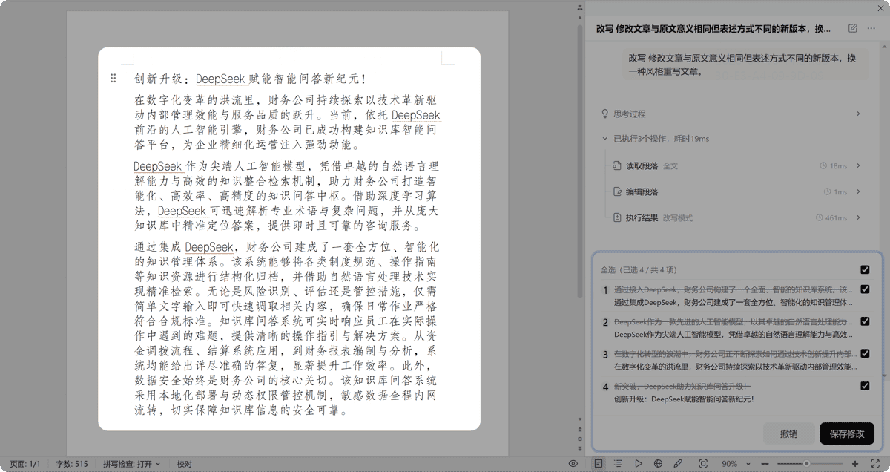

# 改写

> 通过对文档内容的缩写、扩写、重写或续写，按你的要求改编原文。

同一份素材在不同场景需要不同的表述——对内汇报要精简、对外宣传要丰满、上级要看结论、客户要看价值。改写功能帮你基于原文做四种变换：缩写提炼精华、扩写扩充观点、重写换种说法、续写延伸内容。适合市场、内容运营、方案策划等需要反复打磨文案的岗位。

## 使用方式

1. 打开需要改写的文档（或选中要改写的段落）
2. 点击任务类型中的「改写」
3. 选择续写、缩写、扩写或重写
4. 等待处理完成，AI 在文档中生成改写结果

以下演示均基于同一篇示例文档：

## 续写

根据文章内容完成续写，风格和原文保持一致。

## 缩写

将原文高度提炼，整理成最小篇幅，简短扼要。

## 扩写

通过学习原文内容发散出新的观点，而不仅仅是原文意义的延伸。

## 重写

在保持原文意义的基础上，换一种全新的表述方式。

