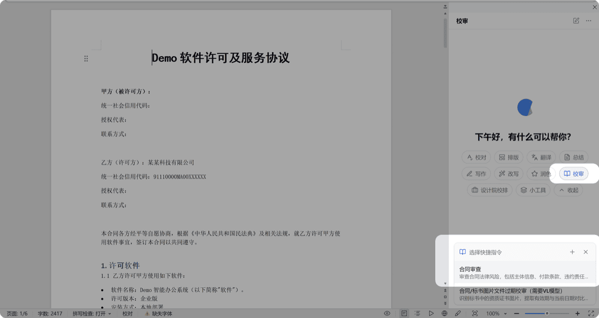
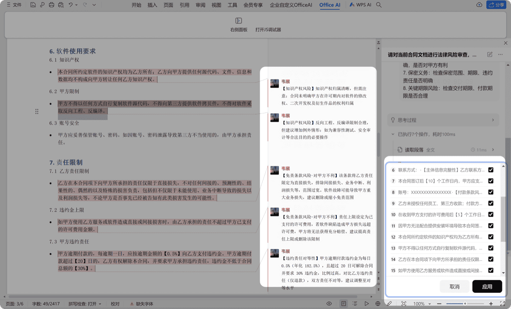

# 审查

> 对合同、标书等文档进行风险审查和信息核查，结果以批注形式标注在文档中。

合同一个条款有漏洞可能造成巨大损失，标书一个偏离可能导致废标。审查功能从多维度扫描文档风险点——付款条件、违约责任、知识产权、资质有效期等，结果以批注形式在原文中标出。适合法务、采购、商务、投标等需要反复核验文档的岗位，降低人为疏漏风险。

## 使用方式

1. 打开需要审查的文档
2. 点击任务类型中的「审查」
3. 选择对应的审查指令
4. AI 识别文档中的风险点和问题，以批注形式展示

 

## 内置指令

| 指令 | 说明 |
|------|------|
| **合同审查** | 从主体信息、付款条款、违约责任、知识产权等 8 个维度审查合同风险 |
| **证书图片过期校审** | 识别标书中资质证书图片的有效期，自动标记过期/临期风险（需 VL 图像识别模型） |
| **智能提取招标采购需求** | 从采购文件中自动提炼六大类需求，生成带重要等级标注的结构化报告 |
| **标书偏离项智能审核** | 同时打开招标文件和投标响应文件，审核商务/技术偏离项 |

## 关于审查功能

- 审查效果取决于企业是否有统一、清晰的审查标准
- 建议将完整的审查标准作为提示词，由管理员在后台配置
- 你也可以在客户端新增个人审查指令
