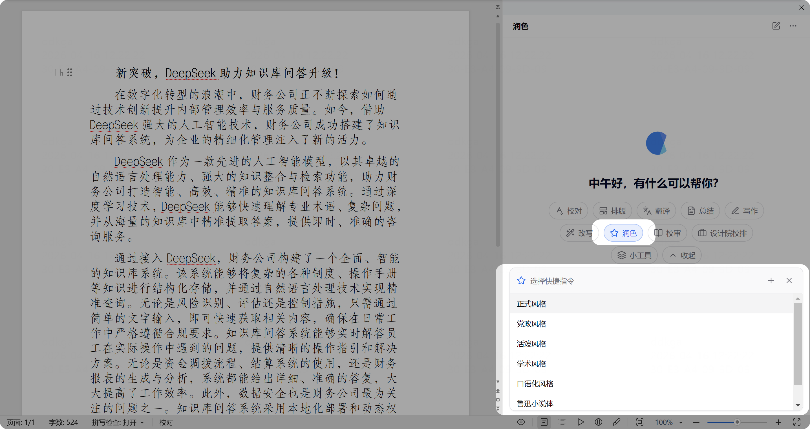
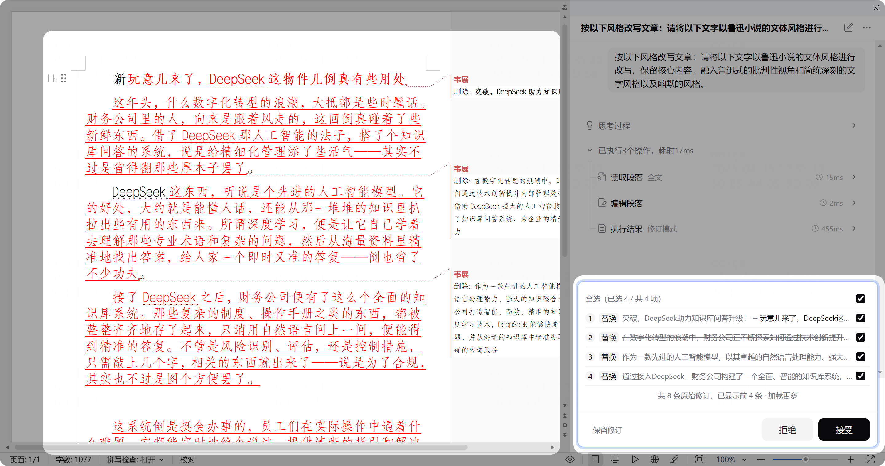

# 润色文档

> 将文档行文按不同风格进行润色处理：更正式、更活泼、更学术，甚至自定义风格。

## 使用方式

1. 打开需要润色的文档
2. 点击任务类型中的「润色」
3. 选择一种润色风格（如「正式公文」「学术风格」「活泼口语」等）
4. 等待处理完成，预览润色效果

## 风格示例

## 自定义润色风格

- 可以在客户端「+」新增自己的润色风格
- 输入自然语言描述，如「用鲁迅的风格润色」
- 保存后下次可直接调用

> 管理员也可以在后台配置企业专属的润色风格。
