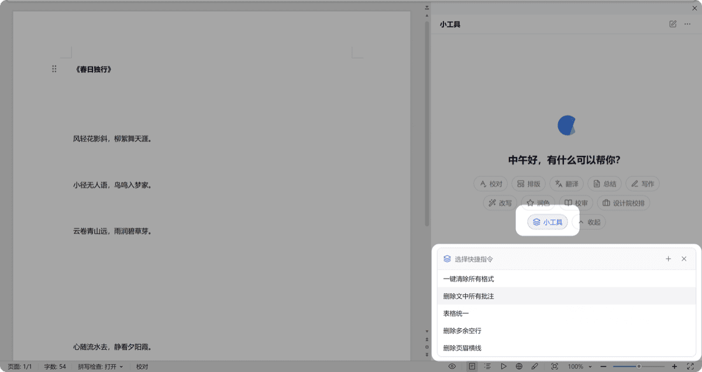
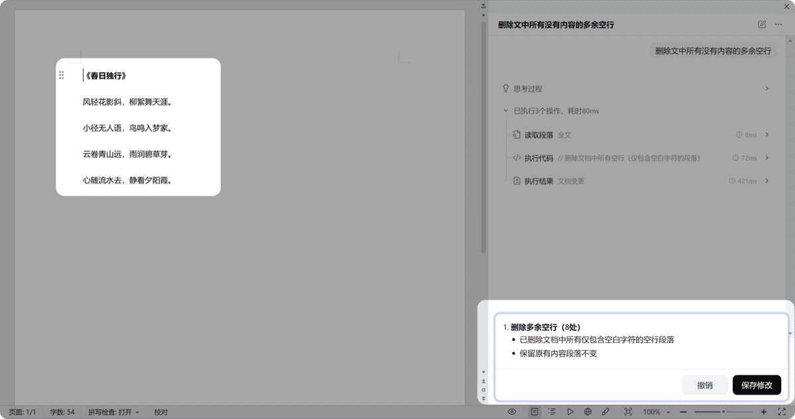
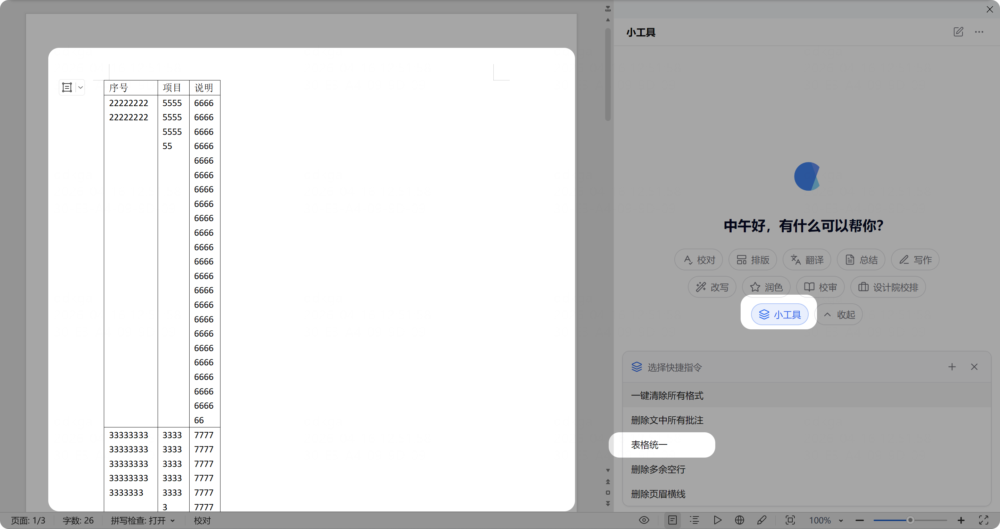
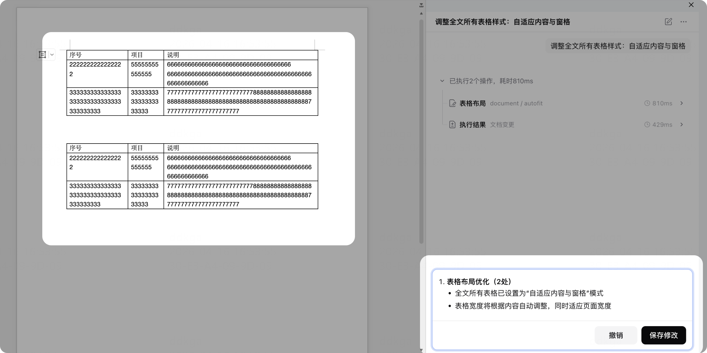

# 小工具

> 处理各种小而繁琐的文档操作，一键完成。

## 删除多余空行

1. 打开需要清理的文档
2. 点击「小工具」→「删除多余空行」
3. AI 自动识别并删除多余空行

 

## 视频教程

  

    
▶️

    
清除格式演示

    
首次加载需等待几秒

  

  

    
▶️

    
删除批注演示

    
首次加载需等待几秒

  

</a>

  
▶️

  
删除批注演示

  <a href="https://github.com/cove-apps/product-manual/releases/download/video-tutorials/10-delete-comments.mp4" target="_blank" style="display:inline-block;padding:6px 14px;background:#2563eb;color:#fff;border-radius:6px;text-decoration:none;font-size:13px;">📥 下载视频</a>

<video src="https://github.com/cove-apps/product-manual/releases/download/video-tutorials/10-delete-comments.mp4" controls width="100%" style="max-width:720px;border-radius:8px;">
  您的浏览器不支持视频播放，请下载后观看。
</video>

> 📺 视频教程（稍后上线）

## 表格统一对齐

1. 打开包含表格的文档
2. 点击「小工具」→「表格统一」
3. 自动调整文档中所有表格的对齐方式

 

## 其他小工具

| 功能 | 说明 |
|------|------|
| **一键清除格式** | 清除文档中所有多余格式 |
| **一键删除批注** | 删除文档中的所有批注 |
| **文档清理** | 按规则批量删除英文段落、URL、邮箱、空行等 |

> 小工具可按你的日常需求自定义增加，尝试用自然语言描述你的需求即可。
