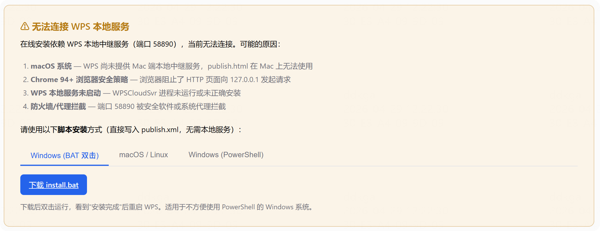

# 常见问题

## 安装失败

如果浏览器在线安装失败，会弹出安装失败的提示窗口。

**解决方法：** 在弹出窗口下方选择对应的操作系统，使用备用安装方式进行安装。

## 登录异常

**Q：登录后提示"账号暂无访问权限"**

可能是管理员还未审批你的注册申请，联系管理员处理。

**Q：登录状态丢失**

检查网络连接是否正常，重新登录即可。如果持续异常，联系管理员检查服务器状态。

## 功能使用

**Q：AI 处理结果不理想**

- 可以多次对话，反复调整直到满意
- 检查是否选择了合适的模型（不同模型能力有差异）
- 确认文档内容清晰，无乱码

**Q：如何撤销 AI 的操作**

在确认弹窗中可以选择「撤销」，文档会自动回到任务前的状态。

**Q：翻译结果不符合预期**

可以尝试更换模型，或调整提示词让 AI 按你的风格翻译。

## 性能相关

**Q：长文档处理慢**

- 建议先选择文档中的关键部分进行选区操作
- 关闭「思考过程」可加快简单任务的处理速度

**Q：插件卡住了怎么办**

- 等待当前任务完成（长文档可能需要几分钟）
- 如果长时间无响应，重启 WPS 后重试
